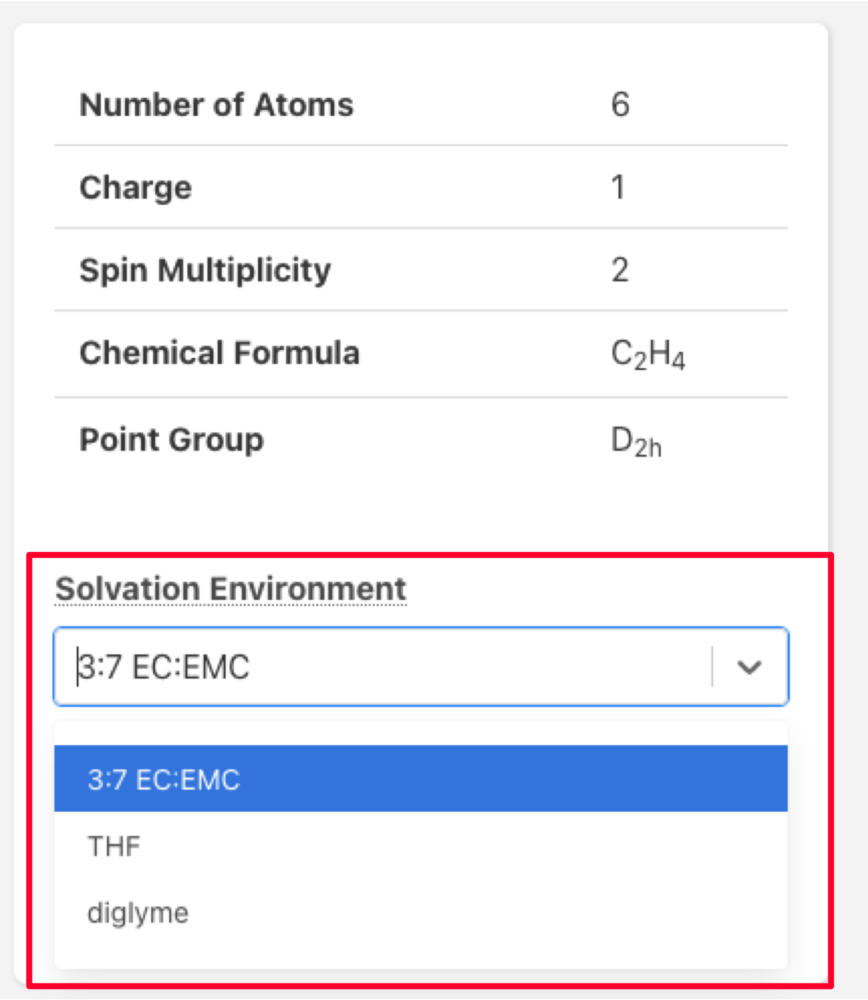

# Tutorial

Visit [Molecules Explorer](https://next-gen.materialsproject.org/molecules);

1. Search for molecules, either by entering search criteria in the search box:

<figure><figcaption>
Search box in the Materials Project Molecules Explorer
</figcaption></figure>

or else apply filters using the box on the left:

<figure><figcaption>
Users can apply filters to a query
</figcaption></figure>

3\. Click "Search" button to show search results.

<figure><figcaption>
Search results, looking for molecules with formula C2 H4 and spin multiplicity 2
</figcaption></figure>

4\. Clicking on a molecule ID will take you to the detail page. At the top of the page, a 3D molecular structure is shown, as well as basic properties like the point group, charge, and spin multiplicity:

<figure><figcaption>
Example molecule detail page for ethylene in the radical cation state.
</figcaption></figure>

5\. In MPcules, properties may be calculated in different solvent environments. You can select which properties you want to see by selecting from the drop-down menu on the right:

<figure><figcaption>
Properties will only be shown for the selected solvent environment (red box)
</figcaption></figure>

