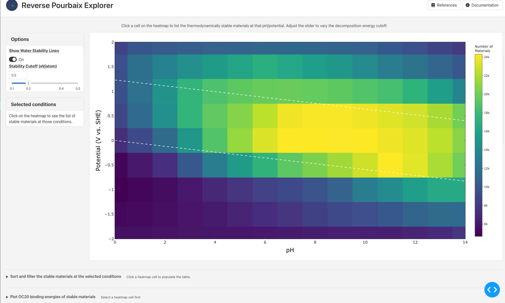
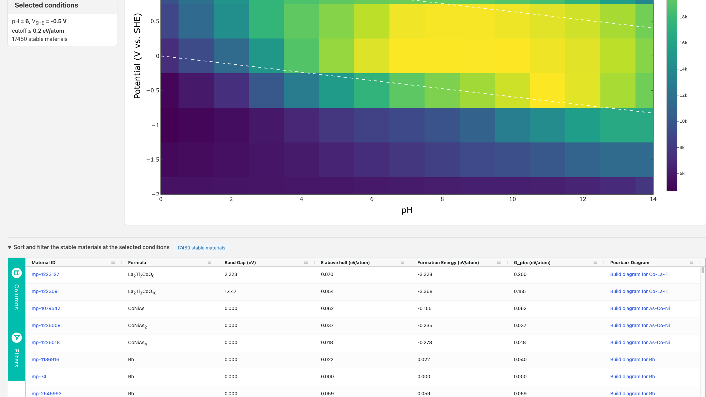
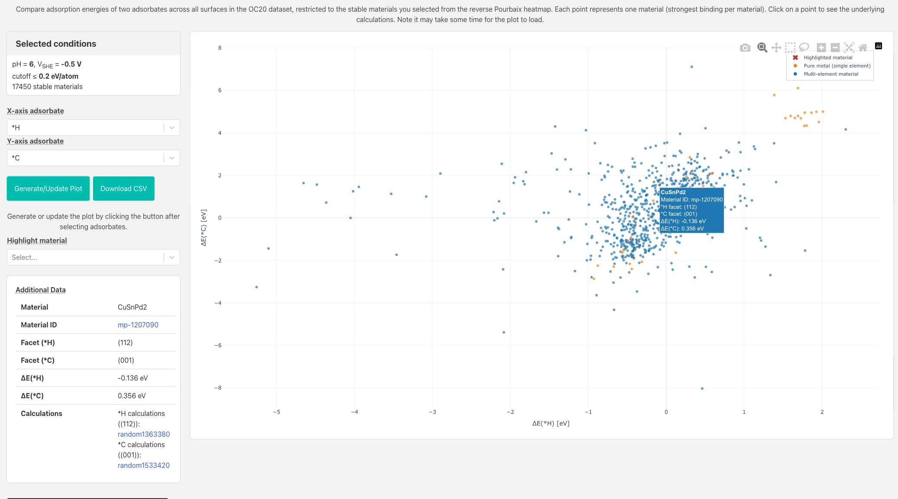
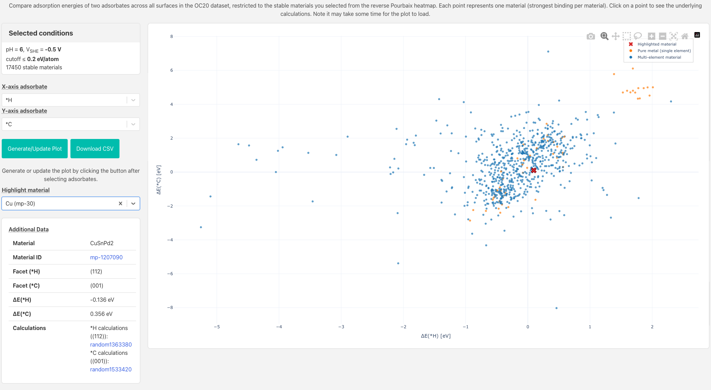
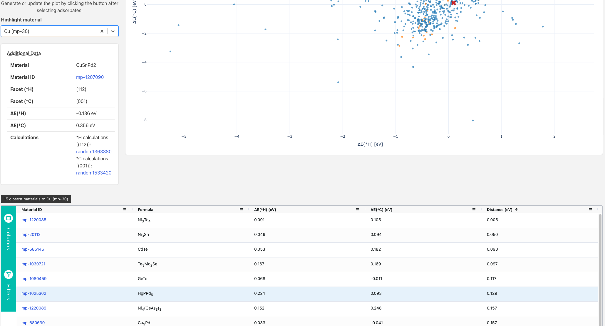

# Reverse Pourbaix Explorer

The Reverse Pourbaix Explorer is a companion to the
[Pourbaix Diagram app](/apps/analysis-apps/pourbaix-app) that inverts the
standard question. Rather than asking "what phases are stable for a single
material at a given pH and potential?", it asks "how many materials are
thermodynamically stable at each point in pH/potential space, and which are
they?" This makes it possible to survey the entire Materials Project database
for candidate materials that are predicted to be stable at a given electrochemical environment at a
glance. For users interested in a materials discovery for catalysis, we also include the ability 
to immediately cross-reference binding energies using
adsorption-energy data from the
[Catalysis Explorer](/apps/explorer-apps/catalysis-explorer).

The app is a single scrolling page. The **Reverse Pourbaix heatmap** sits at
the top, and two collapsible drop-down sections follow below it: a **results
table** of the stable materials at the selected conditions, and an **Adsorbate
Comparison** panel. Both drop-downs are collapsed by default — click their
headers to expand them.


The thermodynamic stability data used in this app is pre-computed from the MP
database using pymatgen's Pourbaix analysis. The adsorption-energy data in the
Adsorbate Comparison section comes from the Open Catalyst 2020 (OC20) dataset,
accessed via the `open_catalyst_project` MPContribs project.


---

## Reverse Pourbaix heatmap

### What the heatmap shows

The heatmap spans **pH 0–14** (x-axis) and **potential −2 to +2 V vs. SHE**
(y-axis). Each cell is coloured by the number of materials from the Materials
Project database that are thermodynamically stable at those conditions, using a
Viridis colour scale (darker = fewer stable materials, brighter = more).

The dashed white lines are the water-stability window:

- **Upper line** — oxygen evolution (O₂/H₂O equilibrium, 1.23 − 0.0592·pH V)
- **Lower line** — hydrogen evolution (H₂/H₂O equilibrium, 0 − 0.0592·pH V)

### Stability cutoff

The **Stability cutoff (eV/atom)** slider in the Options panel controls the
decomposition-energy threshold G\_pbx (the Pourbaix decomposition energy, as
defined in the [Pourbaix Diagram methodology](/methodology/materials-methodology/aqueous-stability-pourbaix)).
A material is counted as "stable" at a cell if its G\_pbx is at or below the
chosen cutoff. The default is **0.2 eV/atom**; the range is 0.1–0.5 eV/atom in
steps of 0.1.

Tightening the cutoff (e.g. 0.1 eV/atom) restricts the count to materials that
are nearly hull-stable in the Pourbaix sense; relaxing it (e.g. 0.5 eV/atom)
will include more candidates.

### Water stability lines

The **Show water stability lines** toggle in the Options panel shows or hides
the dashed white lines described above.

### Clicking a cell

Clicking any cell on the heatmap does three things:

1. The **Selected conditions** panel (bottom-left) updates to show the pH,
   potential, cutoff, and number of stable materials at that point.
2. The **results table** drop-down below the heatmap populates with one row per
   stable material, including formula, band gap, energy above hull, formation
   energy, Pourbaix decomposition energy, and a direct link to the standard
   [Pourbaix Diagram app](/apps/analysis-apps/pourbaix-app) pre-filled with
   that material's composition. This allows for further exploration of the 
   aqueous stability of a material under different conditions.
3. The selected cell is recorded and passed to the **Adsorbate Comparison**
   section for filtering (see below).

### Results table columns

The results table lives in the collapsible **"Sort and filter the stable
materials at the selected conditions"** drop-down directly beneath the heatmap;
expand it to view the table. The header badge reports how many materials are
stable at the selected cell.

| Column | Description |
|---|---|
| Material ID | Linked to the material detail page |
| Formula | Chemical formula |
| Band Gap (eV) | Electronic band gap |
| E above hull (eV/atom) | Thermodynamic stability from the MP phase diagram |
| Formation Energy (eV/atom) | Formation energy per atom |
| G\_pbx (eV/atom) | Pourbaix decomposition energy at the selected conditions |
| Pourbaix Diagram | Link to the [Pourbaix Diagram app](/apps/analysis-apps/pourbaix-app) pre-filled with this composition |

The table columns are sortable and filterable. Numeric columns support range
filters; text columns support substring filters. The **Pourbaix Diagram** column
provides a one-click link to the [Pourbaix Diagram app](/apps/analysis-apps/pourbaix-app)
pre-filled with each material's composition, so you can immediately inspect its
full aqueous stability diagram without re-entering the formula.

---

## Adsorbate Comparison

The Adsorbate Comparison section is the second collapsible drop-down beneath the
heatmap (**"Plot OC20 binding energies of stable materials"**); expand it to
access these controls. It lets you cross-reference the electrochemically
stable materials identified on the heatmap with their catalytic properties from
the OC20 dataset. It plots the minimum adsorption energy of one adsorbate
against another, one point per material, so you can identify promising
bifunctional catalysts or screen for volcano-plot-type relationships.
Not all stable materials have corresponding data in the OC20 data set.
Therefore, fewer number of points than number of stable materials is expected.

### Prerequisites

Before using this section, **click a cell on the Reverse Pourbaix heatmap** to
select a set of stable materials. The "Selected conditions" panel at the top of
the controls column confirms which cell is active. If no cell has been clicked,
clicking "Generate/Update Plot" will show an empty-state message prompting you
to do so first.

### Controls

**X-axis adsorbate / Y-axis adsorbate** — Select the two adsorbates (by SMILES
string) whose minimum adsorption energies will be plotted on the respective axes.
The same adsorbate list used in the [Catalysis Explorer](/apps/explorer-apps/catalysis-explorer)
is available here. The default pair is \*H (X) and \*C (Y).

**Generate/Update Plot** — Fetches OC20 adsorption-energy data for the two
chosen adsorbates, restricted to the stable materials from the selected heatmap
cell. Click this after changing adsorbates or after clicking a new heatmap cell.
The fetch may take a few seconds on first load.

**Download CSV** — Downloads a CSV file (`adsorbate_comparison.csv`) containing
`mp_id` plus one column per axis, labelled with the selected adsorbate (e.g.
`ΔE(*H) [eV]` and `ΔE(*C) [eV]`), for all plotted points. The energy column
headers track whichever adsorbates you chose for the X and Y axes.

### What the scatter shows

Each point represents one material. The plotted coordinates are:

- **X** — minimum adsorption energy ΔE(X-axis adsorbate) across all OC20
  surfaces of that material, in eV. The facet with the strongest binding is used.
- **Y** — minimum adsorption energy ΔE(Y-axis adsorbate), similarly.

Because X and Y are minimised independently, the two coordinates may come from
different crystallographic facets of the same material.

**Colour coding:**
- Blue points — multi-element (alloy/compound) materials
- Orange points — pure elemental metals

Only materials that have OC20 calculations for **both** selected adsorbates are
shown (inner join). Materials with calculations for only one adsorbate are
excluded.

Adsorption energies are sourced from the `open_catalyst_project` MPContribs
project. For more information on the underlying OC20 dataset and how individual
calculations can be browsed, see the
[Catalysis Explorer](/apps/explorer-apps/catalysis-explorer).

### Highlight material

The **Highlight material** dropdown lists every material currently plotted (by
formula and mp-id). Selecting one places a red × marker on that point in the
scatter. Clearing the selection removes the overlay.

When a material is highlighted, the **Closest materials** table below the scatter
populates with the 15 nearest materials in (ΔE\_x, ΔE\_y) space (Euclidean
distance, in eV), sorted by proximity. This makes it easy to find materials with
similar bifunctional adsorption profiles.

 

### Clicking a scatter point

Clicking any point on the scatter opens a detail panel on the left showing:

- Material formula and linked material ID
- The strongest-binding facet (hkl) for each adsorbate
- ΔE values for both adsorbates
- Links to the individual OC20 calculation pages (`/catalysis/<random_id>`) for
  each facet, grouped by adsorbate

This is the same calculation-level detail available in the
[Catalysis Explorer](/apps/explorer-apps/catalysis-explorer), surfaced here in
the context of aqueous stability.

---

## Relationship to other MP apps

| App | Role in the workflow |
|---|---|
| [Pourbaix Diagram](/apps/analysis-apps/pourbaix-app) | Standard (forward) Pourbaix: stability of a *single* composition across pH/potential. Each row in the Reverse Pourbaix table links here with the composition pre-filled. |
| [Catalysis Explorer](/apps/explorer-apps/catalysis-explorer) | Browse OC20 adsorption energies by composition, adsorbate, and facet. The Adsorbate Comparison section surfaces the same data restricted to electrochemically stable materials. |
| [Materials Explorer](/apps/explorer-apps/materials-explorer) | Full property search across the MP database. Material IDs in the results table link to material detail pages. |

A typical workflow might be:

1. Open the Reverse Pourbaix Explorer and identify the pH/potential window of
   interest (e.g. near the oxygen evolution line at pH 7).
2. Click the target cell to see which materials are stable there.
3. Expand the Adsorbate Comparison drop-down, choose adsorbates relevant to the
   reaction of interest (e.g. \*OH and \*OOH for OER), and generate the scatter.
4. Identify promising candidates on the scatter and click through to their OC20
   calculations via the detail panel, or follow the Pourbaix Diagram link in the
   results table to inspect their full stability diagram.

---

## Notes and limitations

- **OC20 coverage.** Not all materials in the MP database have OC20 calculations.
  The Adsorbate Comparison section is limited to the intersection of stable materials
  and OC20-covered materials, which may be small for unusual chemistries or rare
  electrochemical conditions.
- **Data freshness.** The stability data underlying the heatmap is pre-computed
  from a fixed snapshot of the MP database; newly added or revised materials from
  the latest MP releases (including GNoME-derived entries) may not yet be
  reflected. The OC20 adsorption-energy data is fetched live from MPContribs and
  cached for one hour per session.

---

## Citation

If you use the Reverse Pourbaix Explorer in published work, please cite the
following:

**This app**

> Karlsson, L., Frost, E. J. P., Nissen, M. S., Beck, P., Hansen, H. A.,
> Castelli, I. E. and Bagger, A. Exploring the vast landscape of stable materials
> for CO2RR. *Electrochimica Acta* **549**, 148053 (2026).
> DOI: [10.1016/j.electacta.2025.148053](https://doi.org/10.1016/j.electacta.2025.148053)

**Materials Project**

> Jain, A. *et al.* Commentary: The Materials Project: A materials genome approach
> to accelerating materials innovation. *APL Materials* **1**, 011002 (2013).
> DOI: [10.1063/1.4812323](https://doi.org/10.1063/1.4812323)

**Pourbaix stability methodology** ([Pourbaix Diagram app](/apps/analysis-apps/pourbaix-app))

> Persson, K. A., Waldwick, B., Lazic, P. and Ceder, G. Prediction of
> solid-aqueous equilibria: Scheme to combine first-principles calculations of
> solids with experimental aqueous states. *Physical Review B* **85** (2012).

> Singh, A. K., Zhou, L., Shinde, A., Suram, S. K., Montoya, J. H., Winston, D.,
> Gregoire, J. M. and Persson, K. A. Electrochemical Stability of Metastable
> Materials. *Chemistry of Materials* **29** (2017).

> Patel, A. M., Nørskov, J. K., Persson, K. A. and Montoya, J. H. Efficient
> Pourbaix diagrams of many-element compounds. *Physical Chemistry Chemical
> Physics* **45** (2019).

**OC20 adsorption-energy data** ([Catalysis Explorer] (/apps/explore-and-search-apps/catalysis-explorer))

> Chanussot, L., Das, A., Goyal, S., Lavril, T., Shuaibi, M., Riviere, M.,
> Tran, K., Heras-Domingo, J., Ho, C., Hu, W. *et al.* Open Catalyst 2020 (OC20)
> Dataset and Community Challenges. *ACS Catalysis* **11** (10), 6059–6072 (2021).
> DOI: [10.1021/acscatal.0c04525](https://doi.org/10.1021/acscatal.0c04525)
