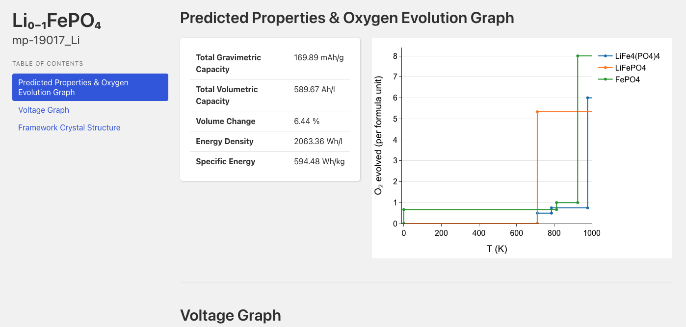

# Oxygen evolution reaction

A critical consideration in designing improved battery electrodes is structural stability at and slightly above operating temperatures. Oxygen evolution reactions (OERs) can lead to structural degradation of the electrode, reducing the number of cycles a potential electrode can withstand.

The MP API client has a feature to generate OER data for the intercalation electrode collection, and the analysis tools used there can be extended further to study electrode materials not in our database. \
\
**NB: the OER data in MP only includes thermodynamic contributions, and neglects kinetic factors.**

#### Methods

Following Ong _et al._, we use the thermodynamic[ phase diagram](../../../../methodology/materials-methodology/thermodynamic-stability/phase-diagrams-pds.md) to trace possible decomposition products, while permitting structural changes, as a function of the effective O<sub>2</sub> chemical potential _μ\*(T)_. To map _μ\*(T)_ for gaseous O<sub>2</sub> to a temperature, we approximate the _PV_ contribution to  Gibbs energy as that of an ideal gas \[1]:

$$
\mu^*(T) \approx \mu(T_0, p_0) + k_B T[1 - S(T)/k_B + \ln(p/p_0)]
$$

We use the NIST JANAF thermochemical tables for oxygen \[2], which provide entropies _S(T)_ measured at _p_=0.1 MPa, and reference ensemble conditions at room temperature: _T_<sub>_0_</sub>=298.15 K  and  _p_<sub>_0_</sub> = 0.21 atm \[1]. Using a spline fit of _T(μ\*)_, we can invert this relationship reliably for a large range of temperatures.&#x20;

#### Examples

For olivine FePO4 ([mp-19017](https://next-gen.materialsproject.org/materials/mp-19017)), the website shows OER mechanisms for all stable entries in the insertion electrodes entry for the corresponding electrode material, [mp-19017\_Li](https://next-gen.materialsproject.org/batteries/mp-19017_Li)

<figure><figcaption></figcaption></figure>

You can retrieve the same data using the API client `mp_api` as follows:\


```python
from mp_api.client import MPRester

with MPRester("your_api_key") as mpr:
    oxyevo = mpr.get_oxygen_evolution("mp-19017","Li")
```

The keys of `oxyevo`  are the formulas of the stable entries in the electrode entry, and its values are `pandas`-friendly dicts of the OER thermodynamic data:

```python
import pandas as pd
print(pd.DataFrame(oxyevo["Fe4 P4 O16"]))
>>> mu                                reaction     evolution  temperature
0 -8.334987                     FePO4 -> FeP + 2 O2  8.000000e+00  1395.096762
1 -7.054396                     FePO4 -> FeP + 2 O2  8.000000e+00   925.094009
2 -7.054396               4 FePO4 -> 2 Fe2P2O7 + O2  1.000000e+00   925.094009
3 -6.761139               4 FePO4 -> 2 Fe2P2O7 + O2  1.000000e+00   812.674113
4 -6.761139  6 FePO4 -> Fe3(P2O7)2 + Fe3(PO4)2 + O2  6.666667e-01   812.674113
5 -4.947961  6 FePO4 -> Fe3(P2O7)2 + Fe3(PO4)2 + O2  6.666667e-01     0.000000
6 -4.947961                          FePO4 -> FePO4 -3.151621e-15     0.000000
```

#### References

\[1] S.P. Ong, A. Jain, G. Hautier, B. Kang, and G. Ceder, "Thermal stabilities of delithiated olivine MPO<sub>4</sub> (M = Fe, Mn) cathodes investigated using first principles calculations", _Electrochem. Commun._ 12, 427–430 (2010), [https://doi.org/10.1016/j.elecom.2010.01.010](https://doi.org/10.1016/j.elecom.2010.01.010)

\[2] M.W. Chase, NIST-JANAF Thermochemical Tables, vol. 12, American Chemical\
Society, New York, 1998. [https://janaf.nist.gov/tables/O-029.html](https://janaf.nist.gov/tables/O-029.html)
