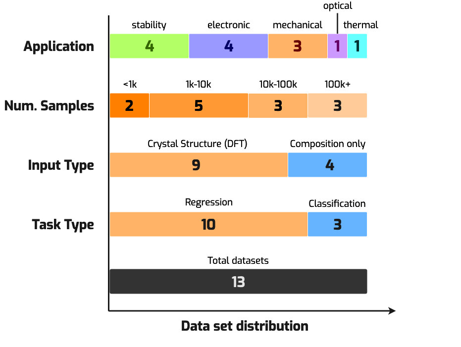
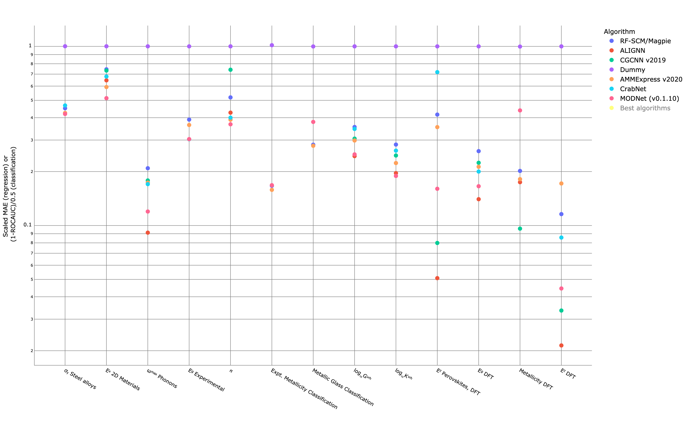

# MatBench

## MatBench

With Alex Dunn of Anubhav Jain's group. Data stored at a dedicated MPContribs site here: \
[https://ml.materialsproject.org](https://ml.materialsproject.org)

Machine learning requires large amounts of clean and reliable data to train new effective\
algorithms. Since the data in the Materials Project is curated and calculated using\
consistent techniques, it is an ideal source of training and benchmarking data.

### Data Access

[Matbench](https://matbench.materialsproject.org) is a Materials Project effort offering diverse datasets available specifically for training, benchmarking, and evaluating machine learning models. These datasets aim to fill a similar purpose within the materials science field as ImageNet did for the development of computer vision algorithms. These Matbench datasets have been [curated, cleaned and standardized](https://doi.org/10.1038/s41524-020-00406-3) specifically for ML applications.

<figure><figcaption></figcaption></figure>

Matbench consists of data sourced both from the Materials Project and also from external sources with:

* The number of samples spanning between 312 and 132,000 entries
* Both experimental and calculated data included
* Data with and without structural information
* A variety of electronic, thermal, thermodynamic, and mechanical properties

<figure><figcaption></figcaption></figure>

The datasets are available through a variety of means:

* Interactively, via [MPContribs-ML](https://ml.materialsproject.org)
* Programmatically, via the [matbench](https://github.com/materialsproject/matbench) python package
* Direct download, via the [Benchmark Info Page](https://matbench.materialsproject.org/Benchmark%20Info/matbench_v0.1/) on the leaderboard website

Please consult the [publication](https://doi.org/10.1038/s41524-020-00406-3) \[1] and [leaderboard website](https://matbench.materialsproject.org) for more information.

### Public leaderboard

A core concern of the development of new ML models is being able to compare and evaluate different\
algorithms consistently. The Matbench initiative is also designed specifically for the purpose of\
comparing materials property prediction algorithms.

Using the Matbench framework, researchers who develop new models can submit their model scores to the Materials Project, and **submissions are open to everyone**!

For more information on how to submit, see our [official documentation](https://matbench.materialsproject.org/How%20To%20Use/1install/).

Along with the [leaderboard](https://matbench.materialsproject.org/), the matbench website also provides for all submissions:

* Detailed and complete information about every benchmark via the [Full Benchmark Data](https://matbench.materialsproject.org/Full%20Benchmark%20Data/matbench_v0.1_Ax_CrabNet_v1.2.1/) page.
* Raw data of every prediction (and optional uncertainties) on the [source repository](https://github.com/materialsproject/matbench)
* [Per-task leaderboards](https://matbench.materialsproject.org/Leaderboards%20Per-Task/matbench_v0.1_matbench_dielectric/) for non-general purpose or specialized algorithms
* Full citation info and statistics for all submissions

<figure><figcaption></figcaption></figure>

See [this dedicated site](https://matbench.materialsproject.org) for more information on the leaderboard and the current best-performing algorithms.

### Tools

Several tools have been developed specifically to work with Materials Project code and data for the\
purposes of machine learning. Some of these tools have been developed within the Materials Project, and\
others developed externally.

#### Automatic featurization with Matminer

[Matminer](https://hackingmaterials.lbl.gov/matminer/) is a do-all Python toolbox for machine learning with materials.

* assigning features to materials primitives (like crystal structures) using routines adapted from peer-reviewed literature
* access to MatBench datasets and other datasets
* create your own datasets with access to multiple online repositories, such as Materials Project, AFLOW, and the Materials Data Facility

<figure><figcaption></figcaption></figure>

<figure><figcaption></figcaption></figure>

Matminer is developed by the [Hacking Materials group](https://hackingmaterials.lbl.gov).

#### "AutoML" for Materials Science with Automatminer

[Automatminer](https://hackingmaterials.lbl.gov/automatminer/) is a fully-automatic engine for predicting materials properties. It automatically determines the appropriate feature sets to apply, generates features and applies feature reduction routines, and searches a large space of ML models and hyperparameters to determine the optimal machine learning pipeline for the problem. Automatminer can be trained and deployed entirely without human tuning, and requires as few as 10 lines of code to train a full pipeline.

<figure><figcaption></figcaption></figure>

Automatminer is developed by the [Hacking Materials group](https://hackingmaterials.lbl.gov), led by Alex Dunn.

## References:

\[1] A. Dunn, Q. Wang, A. Ganose, D. Dopp, and A. Jain, npj Computational Materials 6 (2020) ([DOI](https://doi.org/10.1038/s41524-020-00406-3))

